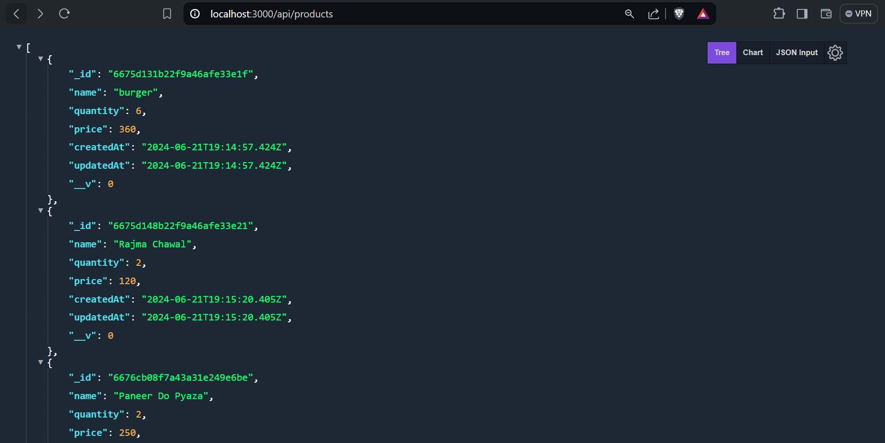

## Documentation

(Images of the project at the end of the documentation)

1. Nodejs installed (already present)
2. NPM installed (already present)

3. express installed
4. checking express is working by creating GET API

5. Checking if the API is working via Postman / Insomnia / ThunderClient

6. Git was already there, skipped it

7. Nodemon installed

8. MongoDB Setup - Creating Project, Cluster, Setting Network Access Permissions
9. install mongodb
10. install mongoose
11. Connect mongoose to the database using the credentials
12. Confirm via console.log msg whether the database is connected or not!

13. Configure Model for the project
14. We create a Product Model js file using mongoose & export the module
15. Create a POST API in the index.js
16. Now upon using the POST API we get undefined when using the ThunderClient to verify it
17. Not allowed to pass json to Nodejs by default
18. So we need to setup a middleware for solving that problem
19. we need to write app.use(express.json) before POST API
20. Once we have verified our POST API is working properly we go on to build CRUD functionalities one by one

21. CREATE FUNCTIONALITY - POST API
22. We create a POST API with a try-catch block containing res status for each : try and catch.
23. We create an async fun to "CREATE" a Product.
24. Also we import the Product model in the index.js file to use the Schema we created earlier.
25. Then we use Postman to sent POST req using the POST API by passing a json in the body.
26. Once the json is successfully passed, we check whether the data is created in MongoDB Database or not.
27. We see that the products are successfully "created" in the database.

28. GET FUNCTIONALITY (ALL DATA) - GET API
29. Created the GET API using try-catch block, async await function, res status lines.
30. Verified the GET Request is working or not through POSTMAN and also directly through browser.

31. GET FUNCTIONALITY (SPECIFIC DATA) - GET API
32. Created the GET API using try-catch block, async await function, res status lines.
33. Here the only difference was that we used findById(id) instead just a simple find().
34. Verified the GET Request is working or not through POSTMAN and also directly through browser.

35. UPDATE FUNCTIONALITY - PUT API
36. Created the PUT API using try-catch block, async await function, res status lines.
37. Verified the PUT Request is working or not through POSTMAN and also directly through browser.

38. DELETE FUNCTIONALITY - DELETE API
39. Created the DELETE API using try-catch block, async await function, res status lines.
40. Verified the DELETE Request is working or not through POSTMAN and also directly through browser.

41. Performing CRUD Operations through Form URL encoded via POSTMAN
42. Currently if we use form url encoded feature of POSTMAN then it will throw an error.
43. The reason is currently our middleware is not configured for that process.
44. app.use(express.urlencoded({ extended: false })); configures the middleware for data to be created via urlencoded form

45. ROUTING in our NODE API
46. Now rather than writing all the APIs in our index.js, we use the concept of routing.
47. We create routes directory and mention all the routes we are going to use in the project.
48. Then export the router to the index.js and then it main file fetches all the APIs from the routes directory rather than hard coded in the index.js file.

49. CONTROLLERS in our NODE API
50. We use the controllers directory to write all the APIs and their try-catch blocks that we wrote in the index.js file.
51. The difference is here we write the mas const and then export them to the routes.js file in order to associate routes with them.

52. Therefore the index.js, ProductRoutes.js and ProductController.js file works hand in hand here!

